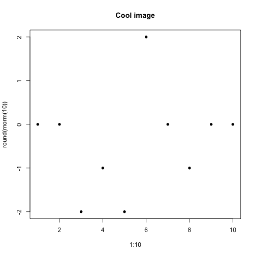
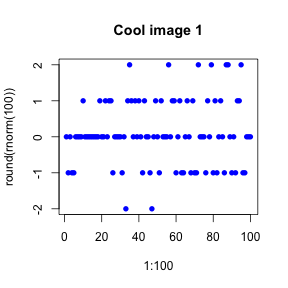
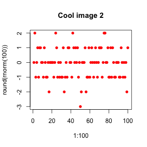
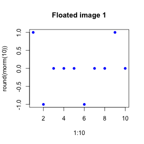

---


# Examples

The code is in `my_report.Rmd` and it should be viewed by opening `my_report.html` in Chrome or Firefox.

## Code chunks

There are two types:


* Block:


```r
3 + 4
```

```
## [1] 7
```


* Inline: `7`

For each chunk, you can decide if you want to show the code along with the result:


```r
3 + 4
```

```
## [1] 7
```


or hide the code and only show the result:


```
## [1] 7
```


Be sure to use different names for the chunk labels or you’ll get an error.

You can also use markdown code blocks, but they don’t get processed:

```
function(var){
    var
}
```

or without backticks (just indent 4 spaces):

    function(var){
        var
    }


## Images

Here’s a cool image:


```r
plot(1:100, round(rnorm(100)), pch = 16, main = "Cool image")
```

 


If you check the `figure/my_report/` folder you’ll see that it automatically generated the `cool_image.png` file from the name of the code chunk. Even though it generated the image file, the call to `markdownToHTML` specifies that images should be embedded in the `html` file using base 64 encoding.

You can generate multiple images inside the same chunk (each one gets a different name based on the code chunk name), as well as change the image dimensions (in inches):


```r
plot(1:100, round(rnorm(100)), pch = 16, main = "Cool image 1", col = "blue")
```

 

```r
plot(1:100, round(rnorm(100)), pch = 16, main = "Cool image 2", col = "red")
```

 


You can also use floats to get text and images side by side.


```r
plot(1:100, round(rnorm(100)), pch = 16, main = "Floated image 1", col = "blue")
```

 


Lorem1 ipsum dolor sit amet, consectetur adipisicing elit, sed do eiusmod
tempor incididunt ut labore et dolore magna aliqua. Ut enim ad minim veniam,
quis nostrud exercitation ullamco laboris nisi ut aliquip ex ea commodo
consequat. Duis aute irure dolor in reprehenderit in voluptate velit esse
cillum dolore eu fugiat nulla pariatur. Excepteur sint occaecat cupidatat non
proident, sunt in culpa qui officia deserunt mollit anim id est laborum.

Use an empty div (or a css fix) to go back to normal.
<div style="clear: both;"></div>

## Multiple languages

Show the contents of your directory using bash


```bash
    ls
```

```
figure
index.html
my_report.Rmd
my_report.html
my_report.md
```


You can even share bash and R variables


```r
Sys.setenv(MY_FOLDER = "/tmp")
```


```bash
    echo "MY_FOLDER = $MY_FOLDER"
```

```
MY_FOLDER = /tmp
```


## Math suppport

knitr uses Mathjax, so you’ll need to be online to render the equations

* Inline: $\mu = \frac{\phi}{3}$
* Center-aligned
$$\mu = \frac{\phi}{3}$$
