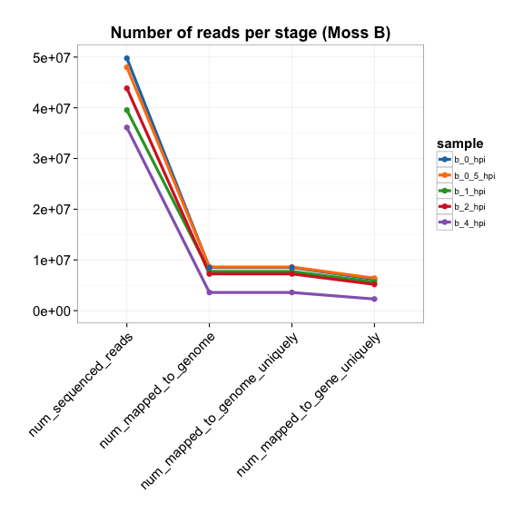

***

# Sample Report

## Analysis of raw data

### Moss B

 

---

The following plots show the raw counts (host reads that align uniquely to a gene) for each experiment.

  

## Fold changes

The following plots show the log fold changes in each of the three experiments. Around 100 genes (in red) pass the arbitrary threshold of 10-fold increase from 0 to 4hpi (6hpi in Anjan).

**Conclusions**:
* The ranked fold change plots show the .6% of genes (100 in red out of 16K) that cross the 10-fold increase threshold.
* The fold change line plots show that the trajectories of the genes that are most expressed at 6hpi/4hpi do not increase uniformly.
* These genes could interat with vaccinia and be needed for infection.
* We don’t have any replicates, so we can’t say anything about significance.

  

